<div align="center">

# 記憶 Kioku

**AI-Powered Japanese Learning Platform for Indonesian Speakers**

[](https://nextjs.org/)
[](https://typescriptlang.org/)
[](https://supabase.com/)
[](https://tailwindcss.com/)
[](https://kioku-learn.vercel.app)

A fullstack web platform combining spaced repetition (FSRS), interactive quizzes, and an AI tutor to help Indonesian speakers learn Japanese vocabulary — completely free.

[Live Demo](https://kioku-learn.vercel.app) · [Security Audit](./SECURITY-AUDIT.md) · [Project Spec](./designs/kioku-project-spec.md)

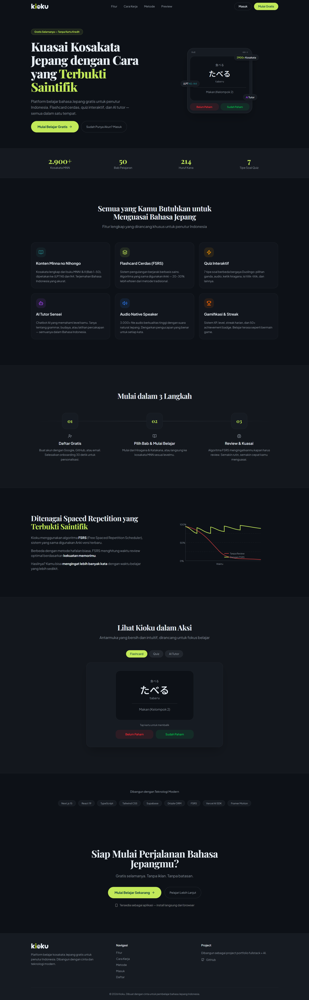

</div>

---

## Why Kioku?

- **Scientific** — Uses the FSRS algorithm (same as Anki v23.10+), 20-30% more efficient than SM-2
- **Comprehensive** — 2,909 vocabulary words, 214 kana characters, 3,085 audio files, 7 quiz types, AI tutor
- **Free** — Runs entirely on free tiers ($0/month)
- **Indonesia-first** — All translations and UI in Bahasa Indonesia

Content sourced from **Minna no Nihongo** Book I (Ch. 1-25, JLPT N5) and Book II (Ch. 26-50, JLPT N4), plus a complete Hiragana & Katakana module for beginners.

---

## Screenshots

<div align="center">

### Dashboard
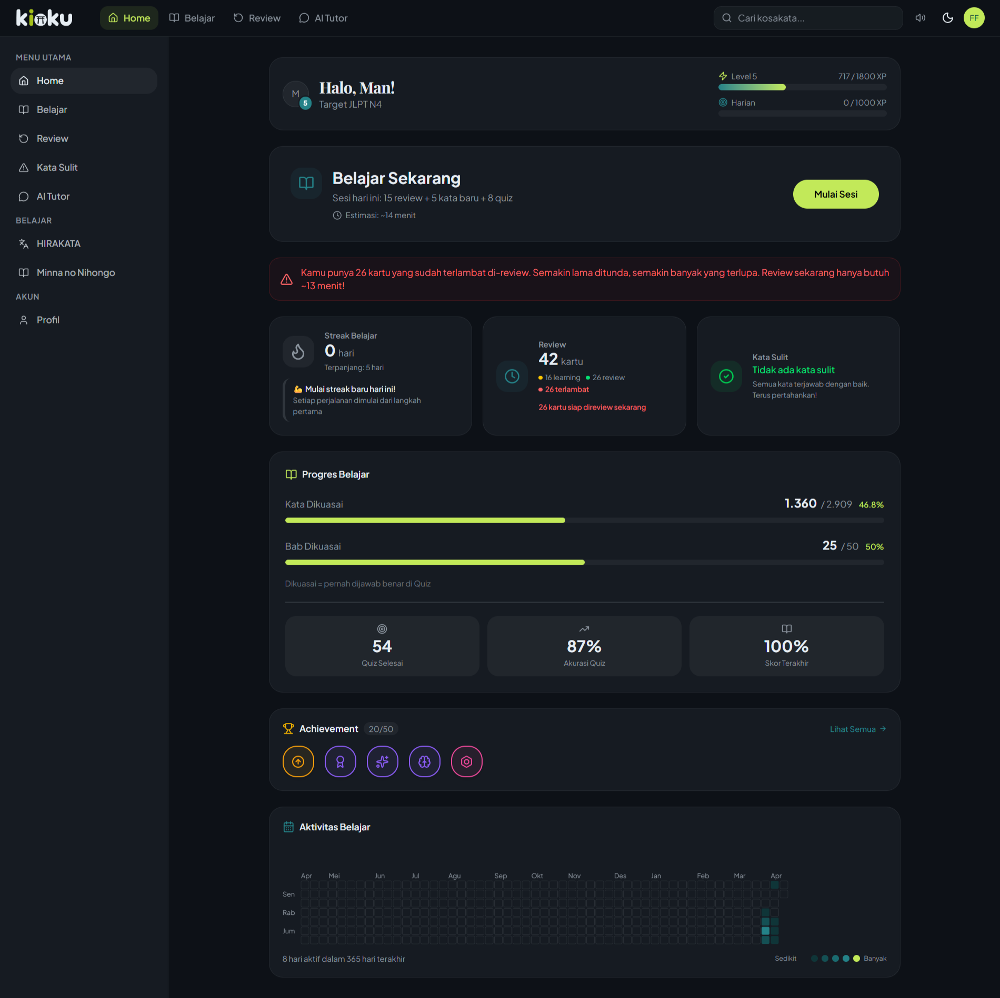

### Learn Hub
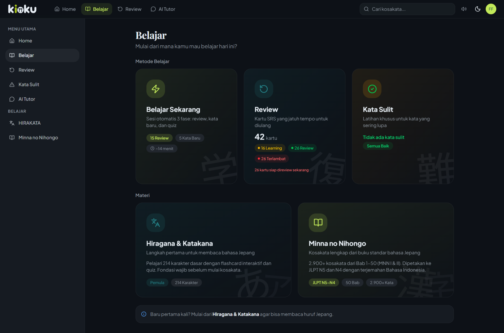

### Profile & Stats
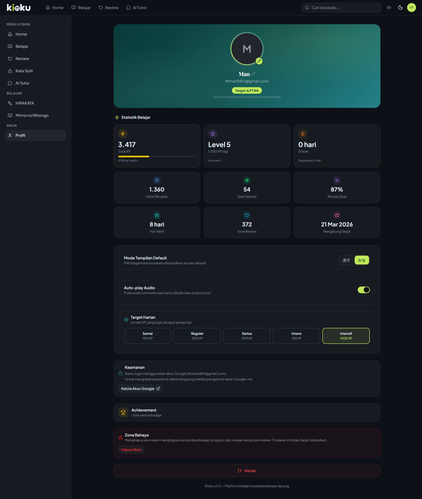

### Flashcard with Spaced Repetition
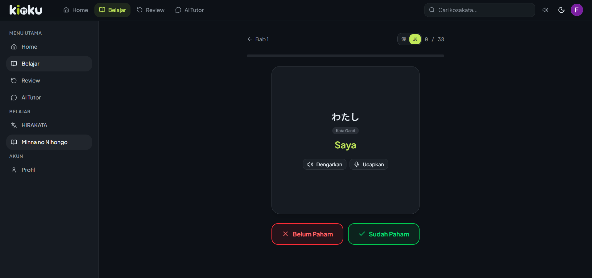

### Interactive Quiz with Explanations
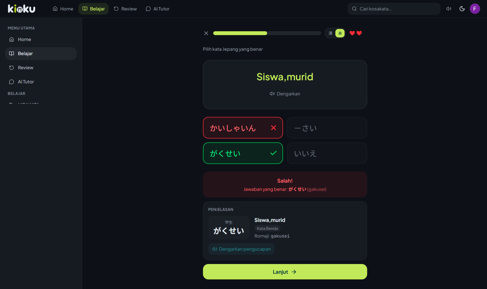

### AI Tutor (Sensei)
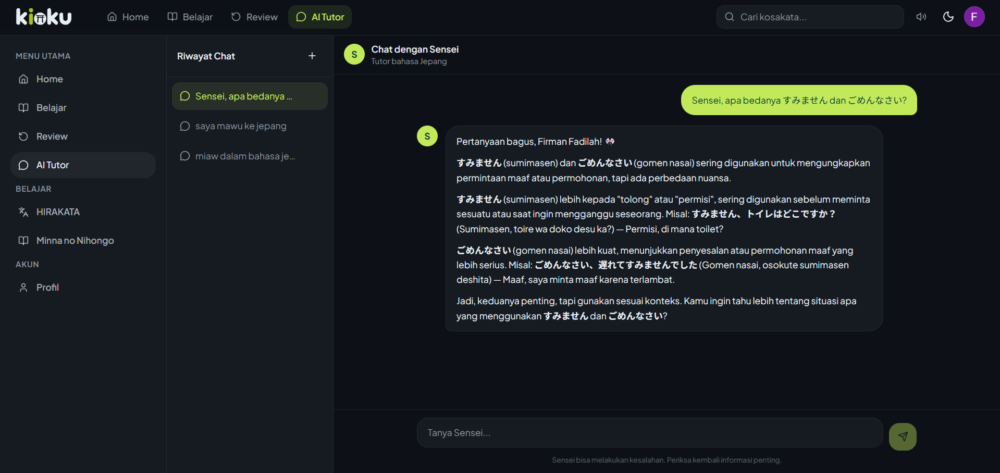

### Hiragana & Katakana Grid
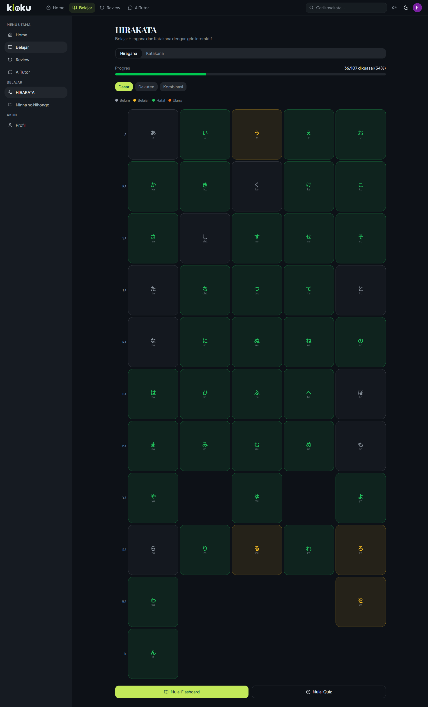

### Smart Study Session
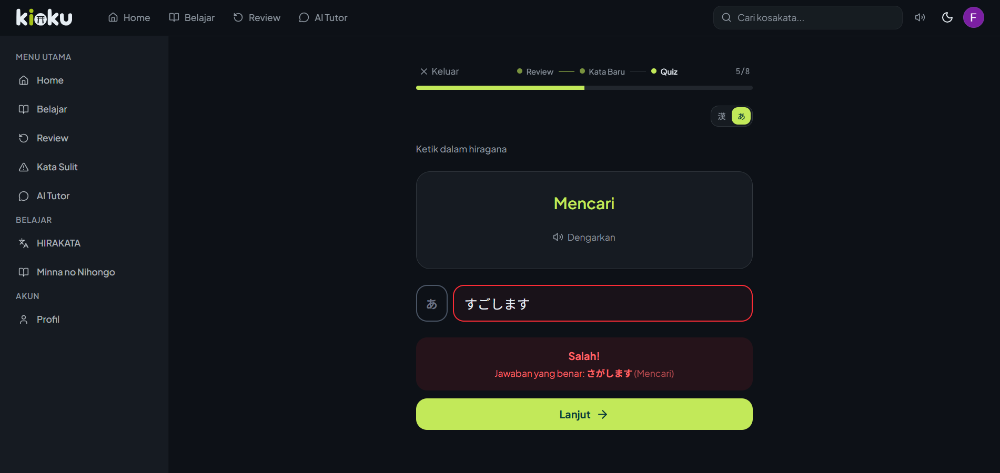

### Session Summary with XP Breakdown
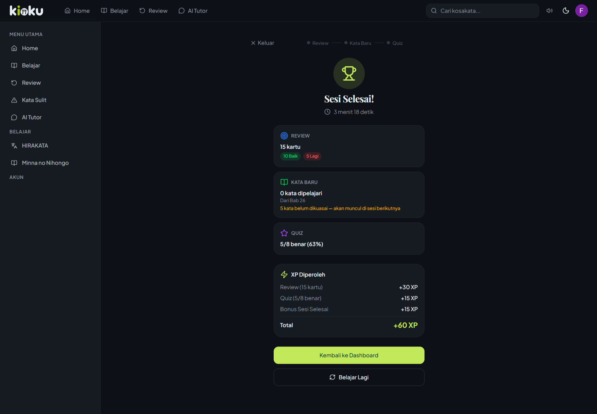

### Kata Sulit (Leech Detection)
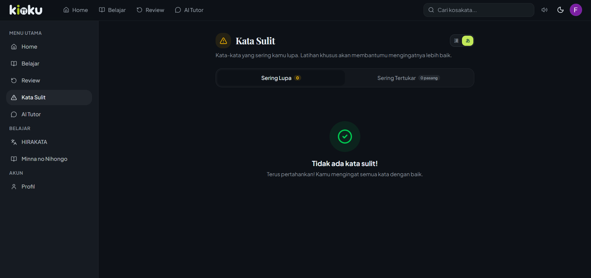

### Review Summary
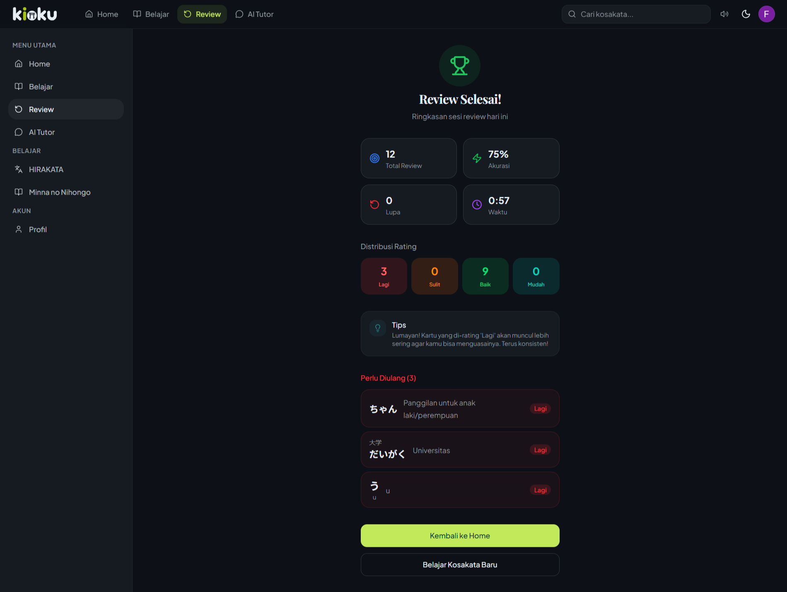

</div>

---

## Features

### Learning
- **Smart Study Session** — One-click optimal study session ("Belajar Sekarang") with 3 phases: review due cards, learn new words, and quiz. Adaptive chapter selection based on JLPT target and user progress
- **HIRAKATA Module** — Learn 214 hiragana & katakana characters with an interactive color-coded grid, flashcards, and quizzes
- **MNN Vocabulary** — 2,909 words from Minna no Nihongo Ch. 1-50 (JLPT N5 & N4), with Indonesian translations
- **Vocabulary Flashcard** — 2-button design (Don't Know / Know) with retry queue (max 3x), simpler than Anki's 4-button approach
- **SRS Review** — 4-button FSRS rating (Again / Hard / Good / Easy) with re-queue for failed cards (max 3x)
- **Leech Detection ("Kata Sulit")** — Automatic detection of frequently forgotten words (lapses >= 4) and confused word pairs from quiz history. Specialized training with intensive flashcard (5x retry) and forced recall quiz
- **Duolingo-style Quiz** — 7 question types: multiple choice (JP-ID, ID-JP), audio recognition, type hiragana, fill-in-the-blank, matching, speaking. 20 questions per session with answer explanations
- **Kanji/Kana Toggle** — Switch between kanji and kana-only display across flashcards, quizzes, and reviews
- **Native Audio** — 3,085 pre-generated audio files using Microsoft Edge TTS (ja-JP-NanamiNeural voice)

### AI Features
- **AI Tutor "Sensei"** — Context-aware chatbot that adapts to the user's JLPT level, with streaming responses and conversation history
- **Multi-Provider Waterfall** — Gemini 2.5 Flash-Lite → Groq (Llama 3.3 70B) → OpenRouter, auto-fallback on rate limits
- **Pronunciation Check** — Web Speech API integration with accuracy scoring (Levenshtein distance + kanji-to-hiragana mapping)
- **Response Caching** — SHA-256 prompt hashing to reduce redundant API calls

### Gamification
- **XP & Levels** — Earn XP from flashcards (2 XP), quizzes (3 XP/correct + tier bonus), and achievements. Level 1-60 with progressive formula
- **Daily Streak** — Streak counter with freeze protection and milestone rewards (7, 14, 30, 60, 90, 180, 365 days)
- **50 Achievements** — Badges for streaks, words learned, quiz scores, speed runs, chapter completion, time-of-day activity, and more
- **Activity Heatmap** — 365-day activity visualization (GitHub-style contribution graph)
- **Daily Goal** — 5 configurable tiers (100 / 300 / 500 / 750 / 1,000 XP) with goal-met bonus

### Smart Navigation & User Experience
- **Interactive Landing Page** — A beautifully designed, fully responsive landing page featuring auto-cycling mockups, smooth animations, and a dynamic feature showcase.
- **Comprehensive Guidebook** — A detailed PDF manual ("Panduan Penggunaan") accessible from both the landing page and user menu, helping learners understand FSRS and maximize the platform.
- **Redesigned Dashboard** — Prominent "Belajar Sekarang" CTA, review countdown timer with clear labels, leech card indicator with sidebar badge
- **Dynamic Streak Reminder** — Time-based personalized messages with 5 distinct slots (dini hari, pagi, siang, sore, malam), countdown to midnight, and color-coded borders per time of day
- **Redesigned Learn Hub** — 3 "Metode Belajar" cards (Belajar Sekarang, Review, Kata Sulit) + 2 "Materi" cards (HIRAKATA, MNN) with gradient styling and dynamic info badges
- **JLPT-Aware** — Dashboard recommends chapters matching the user's target level
- **Auto-upgrade** — Automatically advances from N5 to N4 when all Book 1 chapters are mastered via quiz
- **Progress Tracking** — Quiz-based mastery: a word is "mastered" when answered correctly in a quiz
- **Forced Onboarding** — New users must complete onboarding before accessing the dashboard

### Profile & Personalization
- **9-Stat Grid** — 3 highlight cards (Total XP with progress bar, Level with XP-to-next, Streak with longest) + 6 detail cards (Kata Dikuasai, Quiz Selesai, Akurasi, Hari Aktif, Total Review, Bergabung Sejak)
- **Emoji Avatar Picker** — 16 Japanese-themed preset emoji avatars with gradient ring (lime-to-teal) and rotation animation, plus initial-letter fallback
- **Change Password** — Real-time validation modal for email/password users with strength requirements
- **Google OAuth Integration** — Clear explanation and direct link to Google Account settings for OAuth users
- **Safe Account Deletion** — Multi-step confirmation: warning with real data counts, type "HAPUS AKUN" + 5-second countdown timer to prevent accidental clicks. Cascade delete across all tables + Supabase Auth
- **Real-time Stats** — Force-dynamic ensures fresh data on every navigation

### Data Quality
- **Verified Kana Data** — All 214 hiragana & katakana characters verified and corrected (12 romaji errors fixed: ぢ→ji, づ→zu, を→o, etc.)

---

## Tech Stack

### Frontend
| Technology | Purpose |
|---|---|
| **Next.js 15** (App Router) | Fullstack framework with RSC, Server Actions, streaming |
| **React 19** | UI with Server Components and Suspense |
| **TypeScript 5** | End-to-end type safety (strict mode) |
| **Tailwind CSS 4** | Utility-first styling |
| **shadcn/ui** | Accessible, customizable component library |
| **Framer Motion** | Animations (3D card flip, page transitions, micro-interactions) |
| **Zustand** | Client state (quiz/flashcard sessions, display mode) |
| **TanStack Query v5** | Server state, caching, background refetch |

### Backend & Database
| Technology | Purpose |
|---|---|
| **Supabase** | PostgreSQL + Auth (Google OAuth, email/password, magic link) + Storage (1 GB) |
| **Drizzle ORM** | Type-safe SQL with auto migrations |
| **Zod** | Runtime + compile-time validation on all API routes and Server Actions |
| **ts-fsrs v5** | FSRS spaced repetition algorithm |

### AI & Audio
| Technology | Purpose |
|---|---|
| **Vercel AI SDK** | Unified streaming interface for all AI providers |
| **Google Gemini 2.5 Flash-Lite** | Primary AI provider (free tier) |
| **Groq Cloud** | Fallback #1 — Llama 3.3 70B |
| **OpenRouter** | Fallback #2 |
| **Microsoft Edge TTS** | Pre-generated audio (ja-JP-NanamiNeural), 3,085 files in Supabase Storage |
| **Web Speech API** | Browser-native speech recognition for pronunciation check |

### Infrastructure
| Technology | Purpose |
|---|---|
| **Vercel Hobby** | Hosting + CDN + Serverless (free tier) |
| **GitHub Actions** | CI/CD + Supabase keep-alive cron |
| **PWA** | Service worker + manifest + offline cache + install banner |

---

## Architecture

```
+--------------------------------------------------+
|               CLIENT (Browser / PWA)              |
|  Next.js 15 + React 19 + TypeScript              |
|  Tailwind CSS 4 + shadcn/ui + Framer Motion      |
|  Zustand + TanStack Query                         |
+--------------------------------------------------+
|              SERVER (Vercel Serverless)            |
|  Server Components + Server Actions               |
|  Vercel AI SDK + ts-fsrs v5                       |
|  Drizzle ORM + Zod validation                     |
+--------------------------------------------------+
|             BACKEND SERVICES (Free Tier)           |
|  Supabase PostgreSQL + Auth + Storage              |
|  Gemini -> Groq -> OpenRouter (AI waterfall)       |
+--------------------------------------------------+
|              DEPLOYMENT & CI/CD                    |
|  Vercel Hobby + GitHub Actions                     |
+--------------------------------------------------+
```

**Key data flows:**
- **SRS Engine** — ts-fsrs calculates optimal review intervals per card, scheduling is stored in PostgreSQL
- **AI Waterfall** — Gemini (primary) → Groq → OpenRouter, each provider tried in sequence on failure/rate-limit
- **Audio** — Pre-generated at build time via Edge TTS, stored in Supabase Storage, zero runtime cost
- **Timezone** — All date calculations use WIB (Asia/Jakarta) via centralized utility

### Database

20 tables with Row Level Security (RLS) on all tables:

- **Content** (public read): `book`, `chapter`, `vocabulary` (2,909 words), `kana` (214 chars), `achievement` (50 badges), `ai_question_template`
- **User Data** (RLS protected): `user`, `srs_card`, `review_log`, `quiz_session`, `quiz_answer`, `user_gamification`, `xp_transaction`, `achievement_unlock`, `user_chapter_progress`, `daily_activity`
- **AI** (RLS protected): `ai_chat_session`, `ai_chat_message`, `ai_response_cache`, `pronunciation_attempt`

### Security

Full security audit completed — see [SECURITY-AUDIT.md](./SECURITY-AUDIT.md).

| Area | Status |
|---|---|
| Row Level Security (RLS) | 20/20 tables |
| API Authentication | All endpoints verified |
| Input Validation (Zod) | All forms and API routes |
| Rate Limiting | AI chat (20/min), pronunciation (30/min), search (30/min) |
| Security Headers | HSTS, X-Frame-Options, CSP, X-Content-Type-Options |
| SQL Injection | Protected (Drizzle ORM parameterized queries) |
| XSS | Protected (React auto-escape) |
| CSRF | Protected (Next.js Server Actions) |

---

## Getting Started

### Prerequisites

- Node.js 18+
- npm or pnpm
- [Supabase](https://supabase.com/) account (free tier)
- API keys: [Gemini](https://aistudio.google.com/), [Groq](https://console.groq.com/), [OpenRouter](https://openrouter.ai/) (all free)

### Installation

```bash
# Clone repository
git clone https://github.com/manrandomside/kioku.git
cd kioku

# Install dependencies
npm install

# Setup environment variables
cp .env.example .env.local
# Edit .env.local with your credentials

# Run database migrations
npm run db:migrate

# Seed data (kana + vocabulary)
npm run db:seed

# Start development server
npm run dev
```

### Environment Variables

```env
# Supabase
NEXT_PUBLIC_SUPABASE_URL=your_supabase_url
NEXT_PUBLIC_SUPABASE_ANON_KEY=your_anon_key
SUPABASE_SERVICE_ROLE_KEY=your_service_role_key
DATABASE_URL=your_database_url

# AI Providers
GEMINI_API_KEY=your_gemini_key
GROQ_API_KEY=your_groq_key
OPENROUTER_API_KEY=your_openrouter_key

# App
NEXT_PUBLIC_APP_URL=http://localhost:3000
```

---

## Project Structure

```
src/
├── app/
│   ├── (auth)/            # Login, register, magic link
│   ├── (onboarding)/      # Forced onboarding flow
│   ├── (dashboard)/       # Dashboard, learn, review, quiz, chat, profile, smart-study, kata-sulit
│   └── api/               # API routes (auth, v1/*)
├── components/
│   ├── flashcard/         # Flashcard components (3D flip)
│   ├── quiz/              # Quiz components (7 question types)
│   ├── review/            # SRS review session
│   ├── chat/              # AI tutor interface
│   ├── kana/              # Kana grid & detail modal
│   ├── gamification/      # XP bar, streak, achievements, heatmap
│   ├── pwa/               # PWA install banner
│   └── ui/                # shadcn/ui + custom components
├── lib/
│   ├── srs/               # FSRS engine (ts-fsrs wrapper)
│   ├── ai/                # AI provider waterfall + system prompt
│   ├── audio/             # Audio playback + pronunciation scoring
│   ├── gamification/      # XP, streak, achievement services
│   ├── smart-study/       # Smart Study session service
│   ├── leech/             # Leech detection + confused pairs
│   ├── progress/          # Chapter progress + quiz mastery
│   ├── rate-limit/        # In-memory sliding window rate limiter
│   ├── supabase/          # Supabase client helpers
│   └── utils/             # Timezone (WIB) utilities
├── db/
│   ├── schema/            # Drizzle ORM schema (20 tables)
│   └── migrations/        # SQL migrations
├── stores/                # Zustand stores
└── types/                 # Shared TypeScript types
```

---

## Key Technical Decisions

| Decision | Rationale |
|---|---|
| **Flashcard: 2 buttons** vs Review: 4 FSRS buttons | Simpler UX for learning; full FSRS control only during review sessions |
| **Quiz-based mastery** instead of SRS-based | More intuitive — users understand "answered correctly in quiz" better than SRS status |
| **AI waterfall** (multi-provider) | Maximizes reliability on free tiers; no single point of failure |
| **WIB timezone** for all dates | Target audience is Indonesian; avoids UTC date boundary confusion. Centralized via `timezone.ts` |
| **Pre-generated audio** (3,085 files) | Zero runtime cost, instant playback, no TTS API dependency at runtime |
| **2,909 published** out of 2,692 total vocab | Unpublished entries (`is_published = false`) are words not in the MNN textbook PDFs |
| **Smart Study adaptive selection** | New words chosen based on actual user progress, not just JLPT target (target is only the starting point for new users) |
| **Leech detection** (lapses >= 4) | Automatically identifies frequently forgotten words; confused pairs from quiz history (>= 2 occurrences) |

---

## Running Costs

| Service | Free Tier Limit | Kioku Usage |
|---|---|---|
| Vercel | 100 GB bandwidth | Hosting + CDN |
| Supabase | 500 MB database, 1 GB storage, 50K MAU | PostgreSQL + Auth + Audio storage |
| Gemini | 1,000 req/day | AI chatbot (primary) |
| Groq | ~500K tokens/day | AI fallback #1 |
| OpenRouter | 50 req/day | AI fallback #2 |
| **Total** | | **$0/month** |

---

## License

This project is created for educational and portfolio purposes.

---

<div align="center">

**Kioku** (記憶) — Built for Indonesian learners of Japanese

[Live Demo](https://kioku-learn.vercel.app)

</div>
